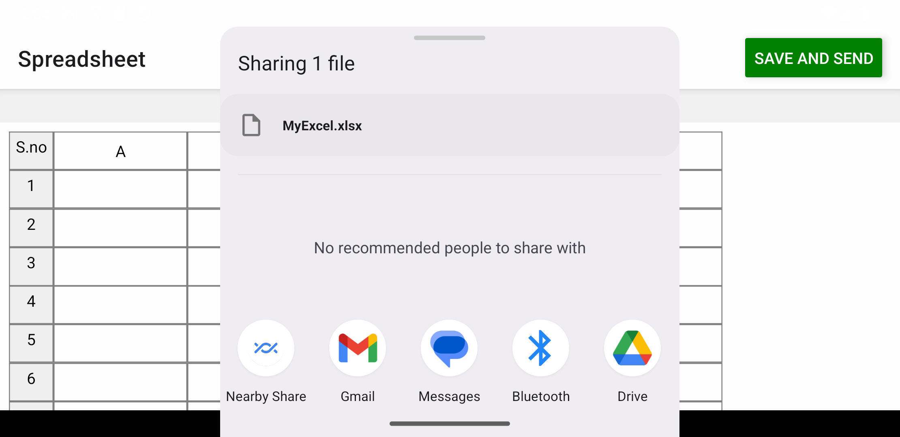
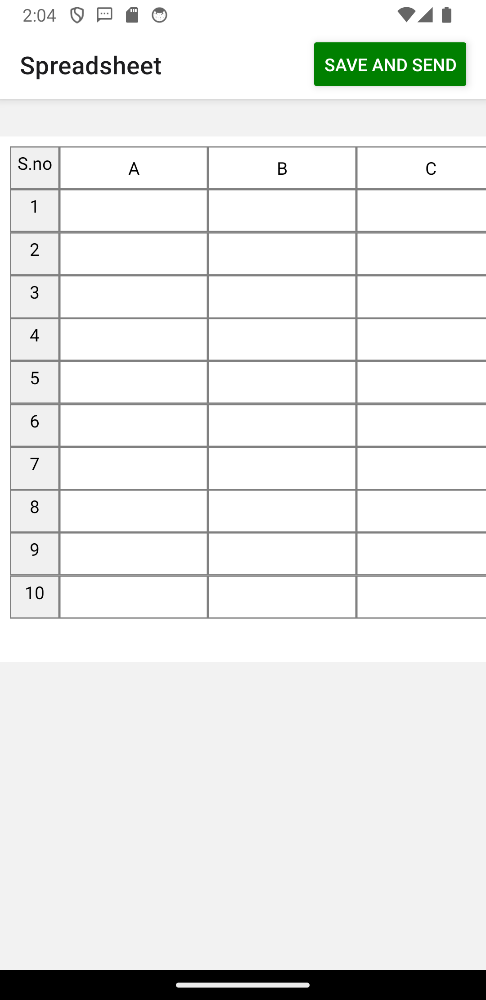
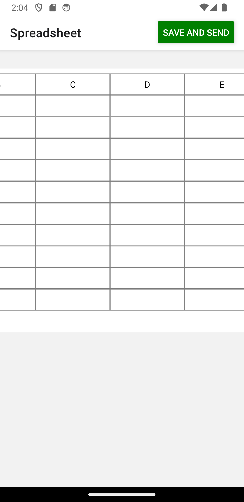
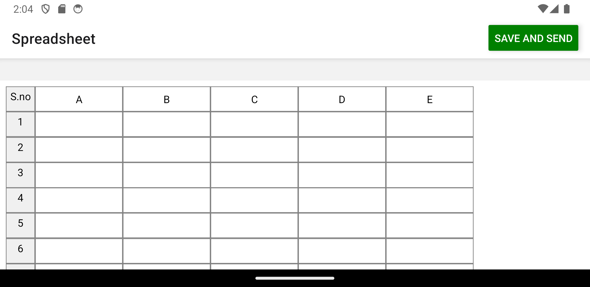
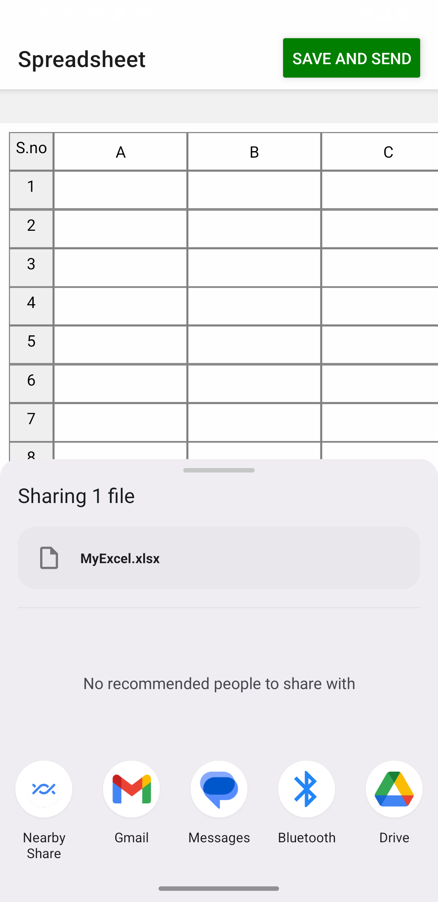

- **XLSX Format:** Utilize XLSX format for spreadsheet compatibility.
- **Grid Interface:** Develop a grid-based input system.
- **State Management:** Implement a data state management system.
- **Async Storage:** Store data using asynchronous storage methods.
- **Filesystem Sharing:** Enable file sharing in markdown format via the filesystem.

